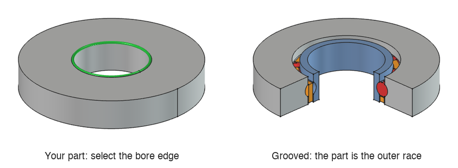

# Deep Groove Ball Bearing - FreeCAD macro

Creates a fully parametric deep groove ball bearing in PartDesign: the inner and outer
races, a snap-in cage and (optionally) the balls. Pick a circular edge - the end of a
shaft, a housing bore, or the bore of a part you want the bearing built into - fill in
the dialog, done. Every size can be changed later from a single place.

Tested with FreeCAD 1.1.

## Install and run

1. Copy `DeepGrooveBallBearing.FCMacro` into your macro folder
   (_Macro → Macros…_ shows its location).
2. Select one circular edge (or nothing, to build the bearing at the origin).
3. _Macro → Macros… → DeepGrooveBallBearing.FCMacro → Execute_.

## Dialog parameters

Every field also has a tooltip in the dialog.

### Races

Where the races come from.

- **Groove selected body** - cut the ball groove into the PartDesign Body the edge belongs
  to; the body itself becomes the races, nothing new is added around it.
  - On a **bore**, the bore is the bearing's inner diameter: a thin inner race is split
    off and the rest of the body is the outer race, with the ball groove in it.
  - On an **outer surface**, it's the other way round: the outer race is split off and
    the body keeps the inner race groove.
  - A plain **ring** you modelled simply becomes the inner and outer race.

  The other diameter and the height set where the groove goes; they're prefilled from the
  body (the nearest matching cylinder, and the length of the selected one).
- **Create races** - build a new ring with both races. The selected edge (on anything, e.g.
  the end of a shaft or a housing bore) sets the bearing's position and axis.

If the groove doesn't cut all the way through the body (e.g. the height is smaller than
the part), the macro warns you that the races aren't separate.

### Selected edge is

Whether the selected edge is the bearing's **inner diameter** or its **outer diameter**.
That diameter is taken from the edge and locked.

- _Groove selected body_: detected - a bore is the inner diameter, an outer surface the
  outer diameter.
- _Create races_: preset from the edge - the end of a shaft is the inner diameter, a
  housing bore the outer diameter - and you can change it.

### Inner diameter, Outer diameter, Height, Ball diameter

- **Inner diameter** - bore of the inner race (the shaft size).
- **Outer diameter** - outside of the outer race (the housing bore size).
- **Height** - axial width of the bearing (_B_ in bearing catalogues).
- **Ball diameter** - the balls run on the pitch diameter, midway between ID and OD, and
  the gap between the two races is always half the ball diameter (a 4 mm ball gives a 2 mm
  gap). Must be smaller than the ring wall, (OD − ID) / 2, and than the height. Default
  4 mm, or smaller when that doesn't fit the bearing.

### Reverse direction

_Create races_ only: builds the bearing on the other side of the selected edge. Use it to
put the bearing _onto_ a shaft instead of past its end.

### Number of balls

How many balls (and cage pockets) are spaced evenly around the bearing. The maximum
depends on ball size and pitch diameter; the macro tells you if it's too many.

### Cage

Snap-in cage between the races that keeps the balls evenly spaced, built as a separate
**Cage** body. Untick the group to leave it out. The cage is drawn _seated_: shifted along
the axis until its pockets are centered on the balls, as it sits in a real bearing.

- **Cage thickness** - radial thickness of the cage ring. It sits in the gap between the
  races, so it can be at most half the ball diameter (2 mm for a 4 mm ball); anything
  less is running clearance. Default 1.5 mm.

  

- **Cage top offset** - sets how tall the cage is: the cage reaches from the races' face to
  this distance short of where the race grooves meet the ball. Larger = shorter cage.

  

- **Pocket clearance** - extra diameter given to each ball pocket so the balls turn freely
  (pocket Ø = ball Ø + clearance).

  

- **Pocket rise** - how far each pocket reaches past the cage's open edge. Smaller = the
  pocket mouth is narrower than the ball, so the balls snap in and are held.

  

### Balls

**Create balls** (off by default) also models the balls as a separate **Balls** body.

## Changing the bearing later

All values are stored on the **BearingParameters** datum inside the bearing's Body. Select
it in the tree and edit the values in the property editor; the races, cage and balls
update. Each bearing has its own datum, so several bearings can live in one document.
With _Groove selected body_, the diameter taken from the selected edge is read-only.

## AI disclosure

This macro and this README were created with the help of AI (Claude by
Anthropic). The design decisions, requirements and the reference model came from the
author; the code was written by the AI and tested in FreeCAD.
