# Deep Groove Ball Bearing — FreeCAD macro

Creates a fully parametric deep groove ball bearing in PartDesign: the inner and outer
races, a snap-in cage and (optionally) the balls. Pick a circular edge — the bore of a
ring you modelled, the end of a shaft or a housing bore — fill in the dialog, done.
Every size can be changed later from a single place.

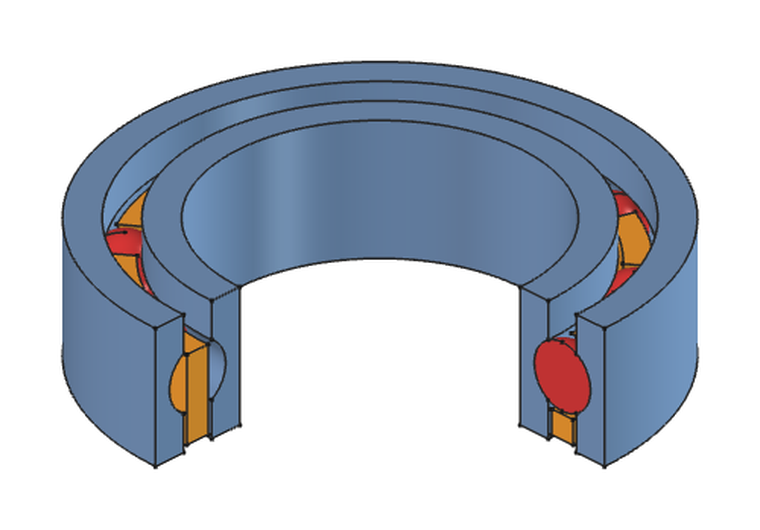

Tested with FreeCAD 1.1.

## Install and run

1. Copy `DeepGrooveBallBearing.FCMacro` into your macro folder
   (*Macro → Macros…* shows its location).
2. Select one circular edge (or nothing, to build the bearing at the origin).
3. *Macro → Macros… → DeepGrooveBallBearing.FCMacro → Execute*.

## Dialog parameters

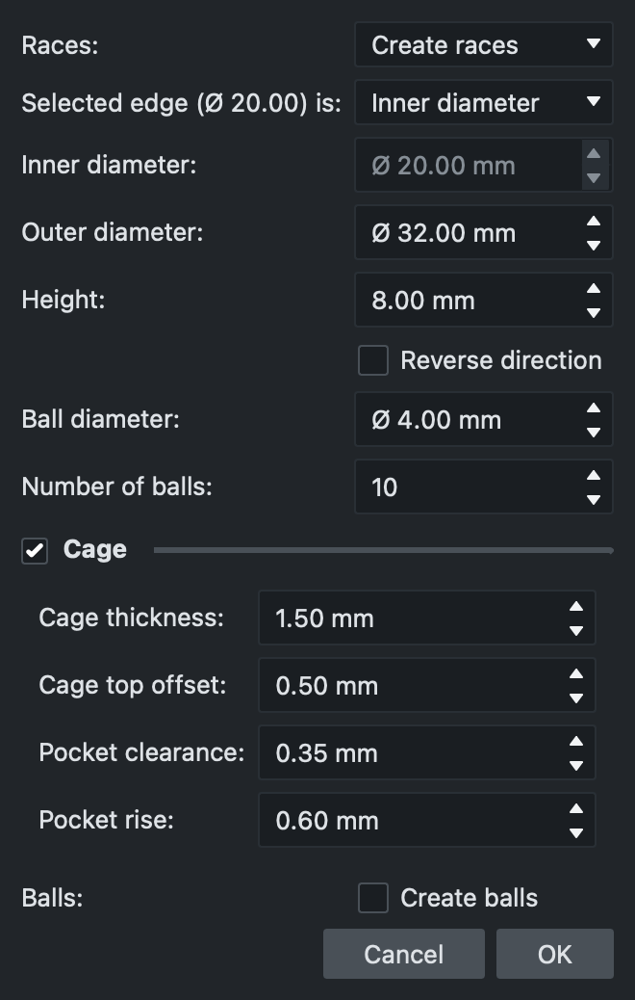

Every field also has a tooltip in the dialog.

### Races

Where the races come from.

- **Use existing races** — groove a ring you already modelled in a PartDesign Body. Select
  an edge on its inner or outer diameter; ID, OD and height are measured from it.
- **Create races** — build a new ring. The selected edge (on anything, e.g. a shaft or a
  housing bore) sets the bearing's position and axis.

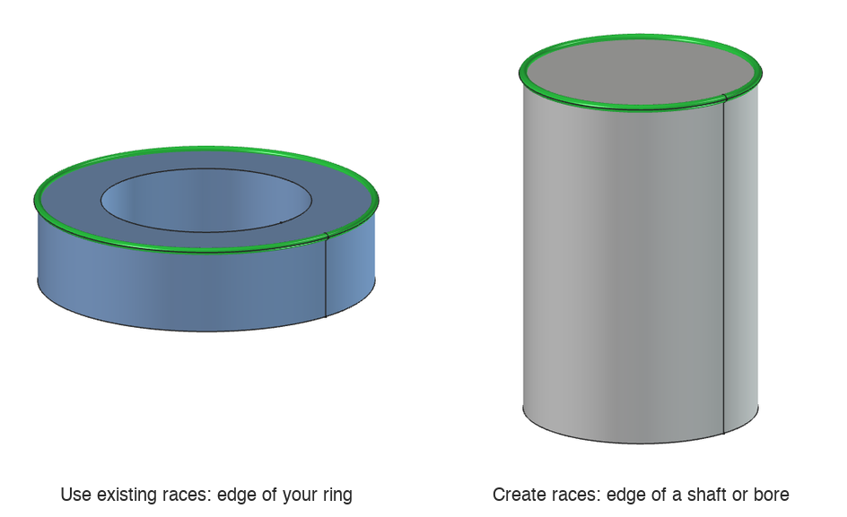

### Selected edge is

*Create races* only: whether the selected edge is the bearing's **inner diameter** (e.g. the
end of a shaft) or its **outer diameter** (e.g. a housing bore). That diameter is taken
from the edge and locked.

### Inner diameter, Outer diameter, Height, Ball diameter

- **Inner diameter** — bore of the inner race (the shaft size).
- **Outer diameter** — outside of the outer race (the housing bore size).
- **Height** — axial width of the bearing (*B* in bearing catalogues).
- **Ball diameter** — the balls run on the pitch diameter, midway between ID and OD, and
  the gap between the two races is half the ball diameter. Must be smaller than the ring
  wall, (OD − ID) / 2, and than the height.

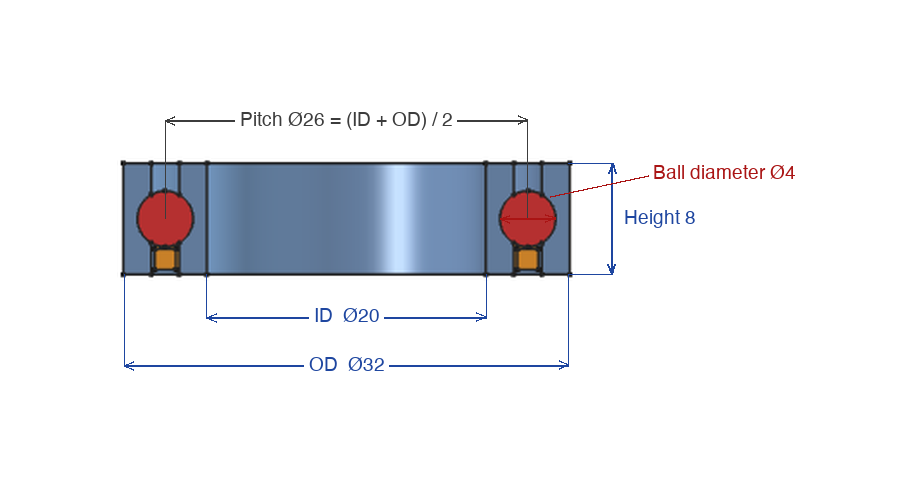

### Reverse direction

*Create races* only: builds the bearing on the other side of the selected edge. Use it to
put the bearing *onto* a shaft instead of past its end.

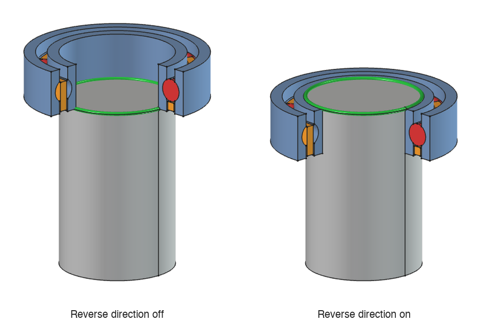

### Number of balls

How many balls (and cage pockets) are spaced evenly around the bearing. The maximum
depends on ball size and pitch diameter; the macro tells you if it's too many.

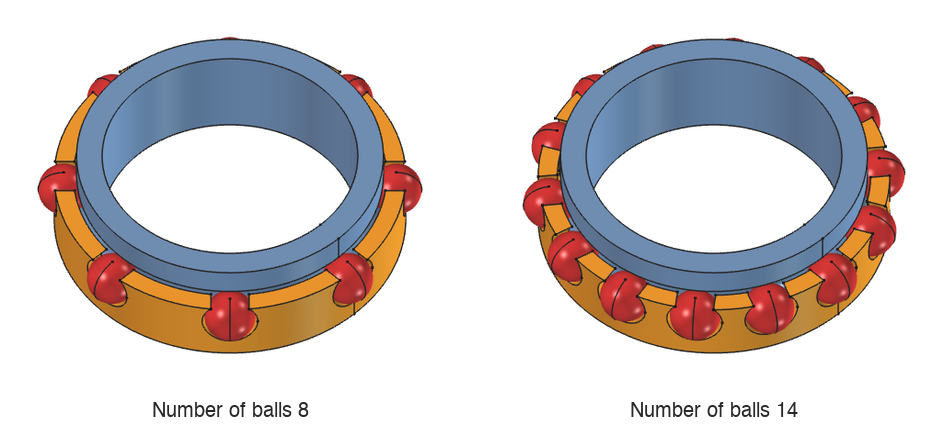

### Cage

Snap-in cage between the races that keeps the balls evenly spaced, built as a separate
**Cage** body. Untick the group to leave it out. The cage is drawn *seated*: shifted along
the axis until its pockets are centered on the balls, as it sits in a real bearing.

- **Cage thickness** — radial thickness of the cage ring. Must be thinner than the gap
  between the races (ball diameter / 2); the rest is running clearance.

  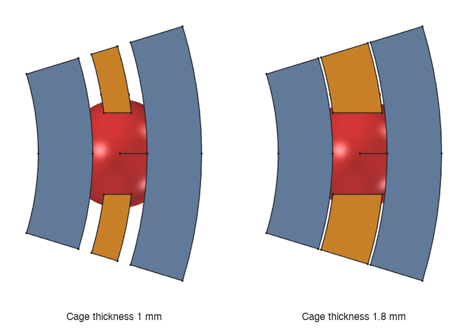

- **Cage top offset** — sets how tall the cage is: the cage reaches from the races' face to
  this distance short of where the race grooves meet the ball. Larger = shorter cage.

  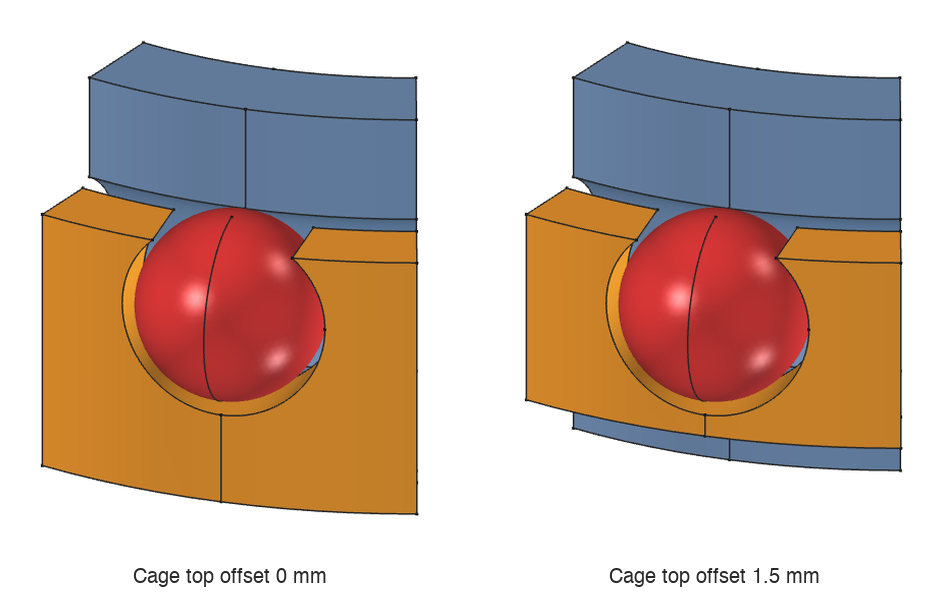

- **Pocket clearance** — extra diameter given to each ball pocket so the balls turn freely
  (pocket Ø = ball Ø + clearance).

  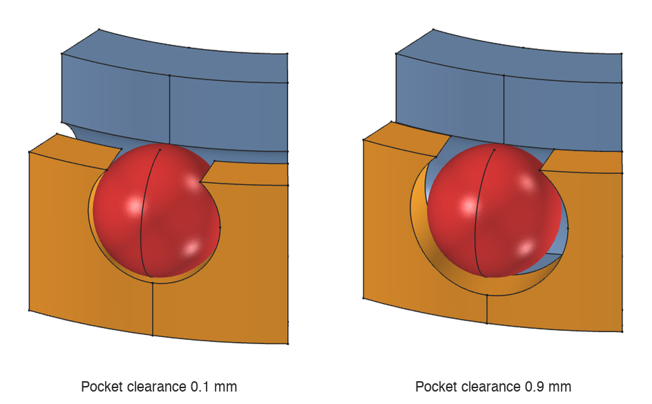

- **Pocket rise** — how far each pocket reaches past the cage's open edge. Smaller = the
  pocket mouth is narrower than the ball, so the balls snap in and are held.

  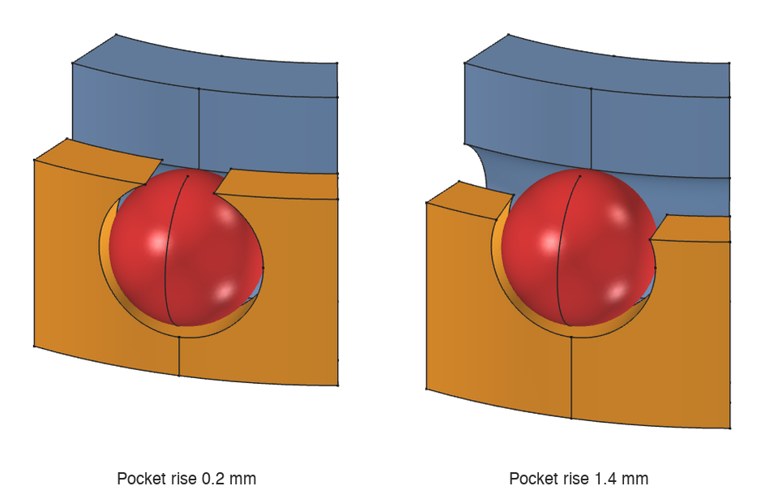

### Balls

**Create balls** (off by default) also models the balls as a separate **Balls** body.

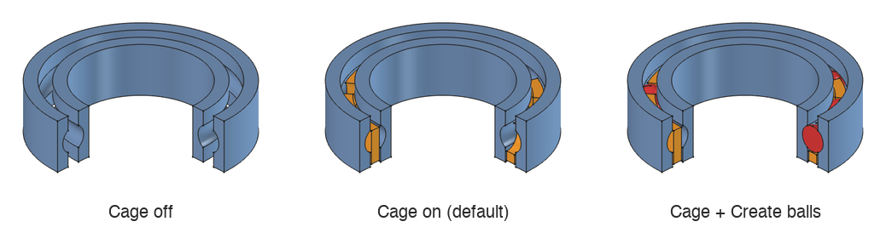

## Changing the bearing later

All values are stored on the **BearingParameters** datum inside the bearing's Body. Select
it in the tree and edit the values in the property editor; the races, cage and balls
update. Each bearing has its own datum, so several bearings can live in one document.
With *Use existing races*, ID, OD and height are measured once and shown read-only.
